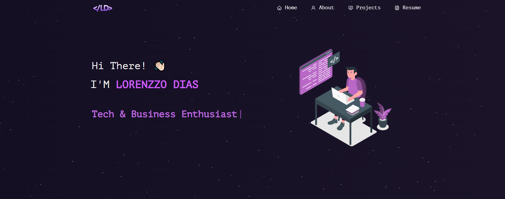

<h2 align="center">
  Portfolio Website<br/>
  <a href="https://your-portfolio.vercel.app" target="_blank">View Live</a>
</h2>

<div align="center">
  
</div>

<br/>

---

## 📌 About

This is my personal portfolio website, where I showcase my projects, technical skills, and experience as a Software Engineering student.

The goal of this portfolio is to present real projects and demonstrate my skills in both front-end and back-end development.

---

## 🚀 Features

- 📖 Multi-page layout  
- 🎨 Modern UI with React-Bootstrap  
- 📱 Fully responsive design  
- 💼 Projects showcase  
- 📄 Resume download  

---

## 🛠️ Built With

- React.js  
- Node.js  
- JavaScript  
- CSS3  
- React-Bootstrap  
- Vercel  

---

## ⚙️ Getting Started

To run this project locally:

```bash
git clone https://github.com/LorenzzoDiass/Portfolio.git
cd portfolio
npm install
npm start